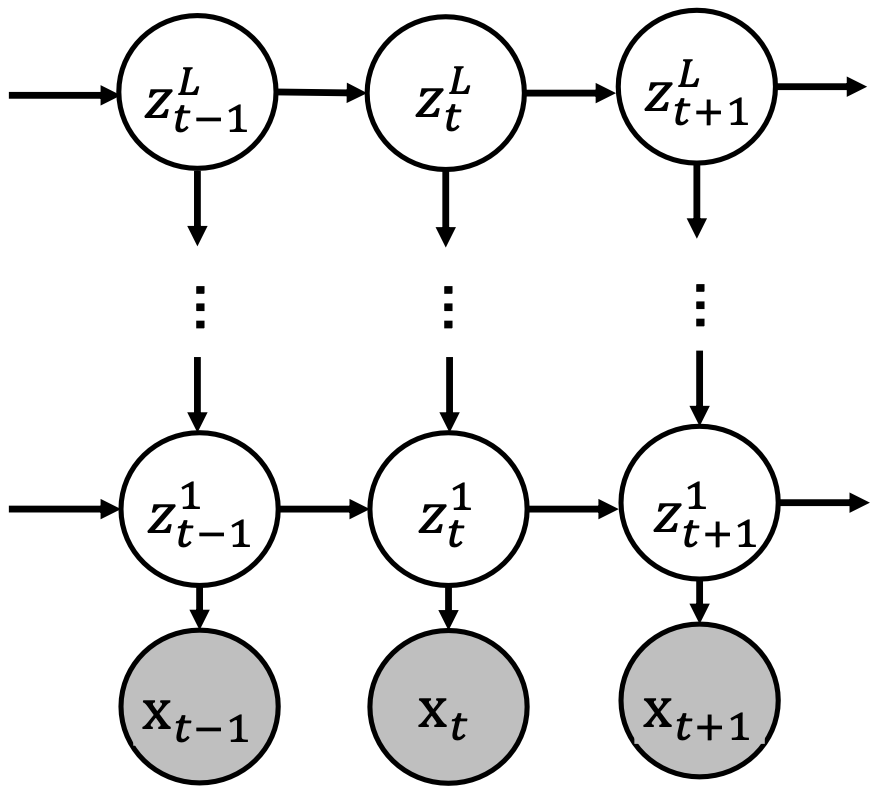
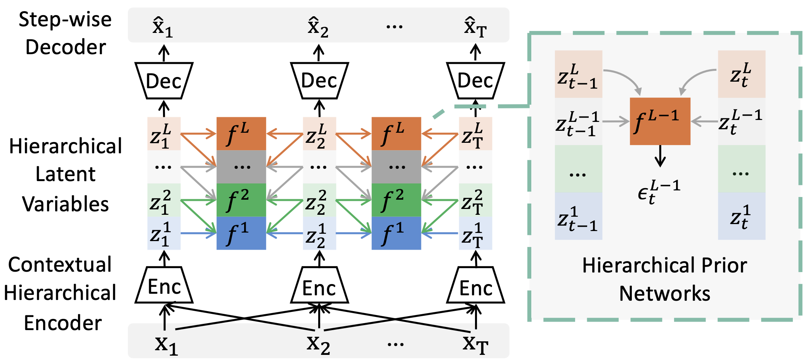
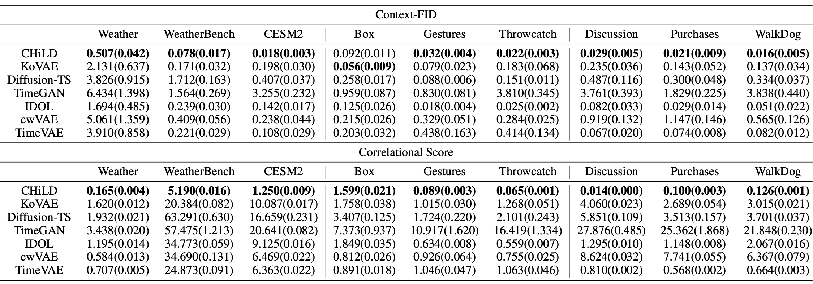

# CHiLD: [Towards Identifiability of Hierarchical Temporal Causal Representation Learning](https://arxiv.org/abs/2510.18310) (Neurips 2025)

[Zijian Li](https://scholar.google.com/citations?user=j3ilESoAAAAJ)<sup>1,2,\*</sup>, [Minghao Fu](https://minghaofu.github.io/)<sup>4,2,\*</sup>, Junxian Huang<sup>3</sup>, [Yifan Shen](https://sanshuiii.github.io/about/)<sup>2</sup>, [Ruichu Cai](https://ruichucai.github.io/)<sup>3</sup>, [Yuewen Sun](https://yuewen-sun.github.io/)<sup>1,2</sup>, [Guangyi Chen](https://chengy12.github.io/)<sup>1,2</sup>, [Kun Zhang](https://www.andrew.cmu.edu/user/kunz1/)<sup>1,2</sup> 

<sup>1</sup> Carnegie Mellon University  <sup>2</sup> Mohamed bin Zayed University of Artificial Intelligence  <sup>3</sup> Guangdong University of Technology  <sup>4</sup> University of California, San Diego  


## Motivation

Modeling hierarchical latent dynamics behind time series data is critical for capturing temporal dependencies across multiple levels of abstraction in real-world tasks. However, existing temporal causal representation learning methods fail to capture such dynamics, as they fail to recover the joint distribution of hierarchical latent variables from single-timestep observed variables. Interestingly, we find that the joint distribution of hierarchical latent variables can be uniquely determined using three conditionally independent observations. Building on this insight, we propose a **C**ausally **Hi**erarchical **L**atent Dynamic (**CHiLD**) identification framework. The time series generation process with a hierarchical latent causal process as shown in Figure 1.

<p align="center">

<br><br>
<b>Figure 1.</b> Illustration of data generation process with hierarchical temporal dynamics 
that consists of $L$-layer latent variables. 
The observed variables $\mathbf{x}_t$ are generated by $\mathbf{x}_t=\mathbf{g}(\mathbf{z}_t^1,\epsilon_t^0)$ where $\mathbf{g}$ and $\epsilon_t^0$ denote the nonlinear mixing function and noise, respectively. 
And $\mathbf{z}_t^l$ are influenced by its time-delayed and hierarchical parents $\mathbf{z}_{t-1}^l$ and $\mathbf{z}_t^{l+1},\,l\leq L-1$ , respectively.
</p>

## Model

Based on theoretical results, we develop the **CHiLD** model as shown in Figure 2.

<p align="center">

<br><br>
<b>Figure 2.</b> The overall framework of CHiLD, which incorporates contextual Hierarchical encoder (Enc), step-wise decoder (Dec), and hierarchical prior networks.

## Requirements

- Python==3.10
- torch==2.4.1
- tqdm==4.64.1
- einops==0.8.0
- numpy==1.24.4

Dependencies can be installed using the following command:
```bash
pip install -r requirements.txt
```

## Data

We have already put the datasets in the `dataset.zip` file. Please unzip it before running the code:

```bash
unzip dataset.zip
rm dataset.zip # optional
```

## Reproducibility

To easily reproduce the results you can run the following commands:
```shell
bash ./scripts/ETT/ETTh1.sh
```

And we provide explanations for the important parameters:

| Parameter name | Description of parameter                                                                                                                                                                  |
|----------------|-------------------------------------------------------------------------------------------------------------------------------------------------------------------------------------------|
| data           | The dataset name.                                                                                                                                                                         |
| root_path      | The root path of the data file (defaults to `./dataset/human/`).                                                                                                                          |
| data_path      | The data file name (defaults to `WalkDog_all.npy`).                                                                                                                                       |
| features       | The forecasting task (defaults to `M`). This can be set to `M`,`S`,`MS` (M : multivariate predict multivariate, S : univariate predict univariate, MS : multivariate predict univariate). |
| seq_len        | Input sequence length.(defaults to `24`).                                                                                                                                                 |
| des            | Exp description.                                                                                                                                                                          |
| itr            | Experiments times.                                                                                                                                                                        |
| train_epochs   | Epochs in train.                                                                                                                                                                          |
| layer          | Hierarchical layers of the model.                                                                                                                                                         |

More parameter information please refer to `main.py`.

## Results

The main results are shown in Table 1.

<p align="center">
<b>Table 1.</b>Main results of real-world datasets.<br>

<br><br>
</p>

## Citation

If you find this repository useful in your research, please consider citing the following papers:
```
@article{li2025towards,
  title={Towards Identifiability of Hierarchical Temporal Causal Representation Learning},
  author={Li, Zijian and Fu, Minghao and Huang, Junxian and Shen, Yifan and Cai, Ruichu and Sun, Yuewen and Chen, Guangyi and Zhang, Kun},
  journal={arXiv preprint arXiv:2510.18310},
  year={2025}
}
```